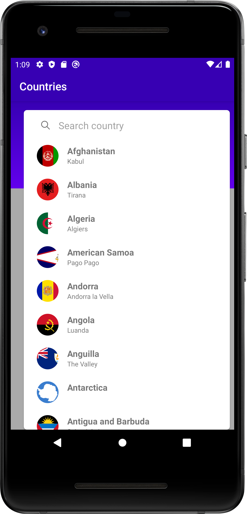
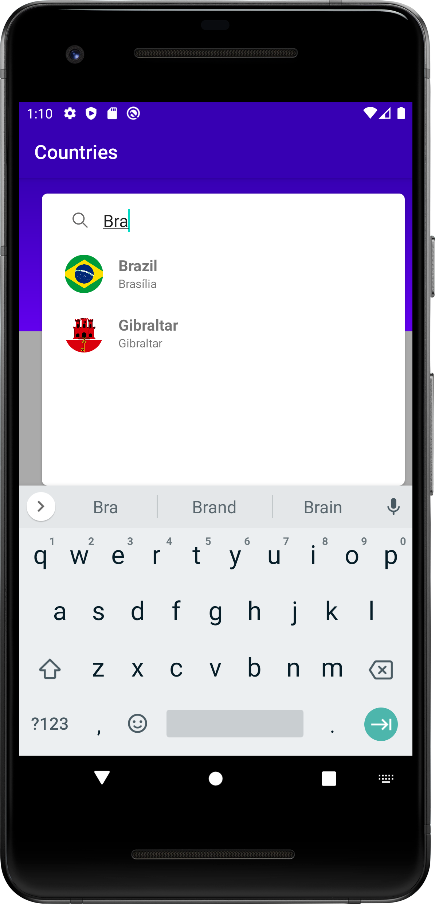
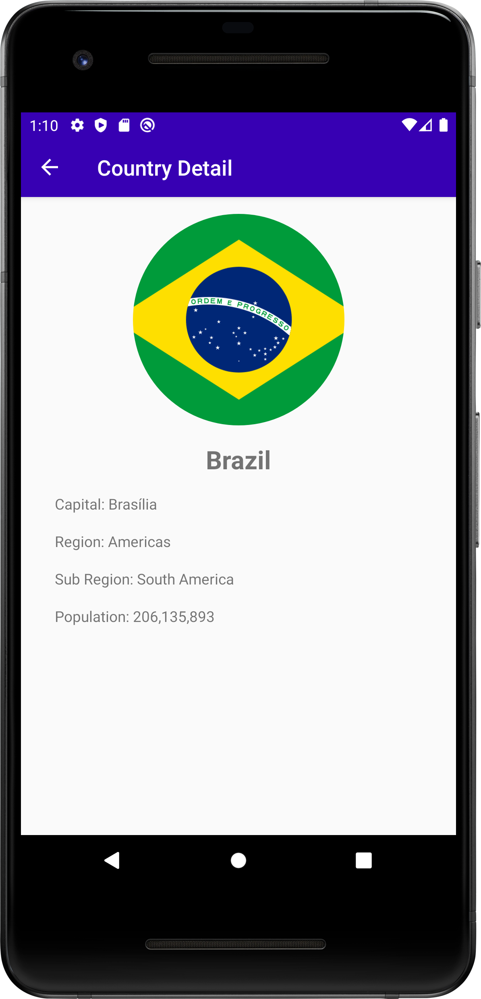

# About
This is a sample project to try the Google Architecture Components, here you will find an example of unidirecdional data flow implementation using coroutines flow. 
The project is cover by uinit tests using JUnit + Mockito and integration tests using espresso(tests in progress...). 

# Project Overview
The project is consuming the https://restcountries.eu/ free api and contain the bellow use cases
* List of countries
* Search country by name
* Show contry details

## Screenshots

## Libraries
* Hilt
* Retrofit
* Okhttp
* Gson
* Room
* Coroutines
* Navigation
* Live data
* Espresso
* Mockito
* JUnit

### References
https://developer.android.com/topic/libraries/architecture
